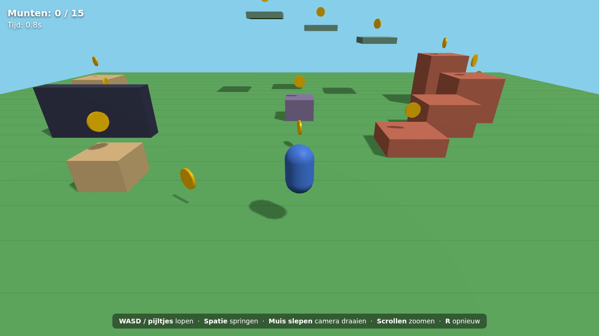

# Munt Jager 3D

Een **actie-RPG met levels** in de browser, in de stijl van Elden Ring, gemaakt met **JavaScript** en **[Three.js](https://threejs.org/)**.
Kies je held, volg het pad door 4 levels, versla vijanden voor munten, help de dorpelingen met zij-quests,
word sterker door vijanden te verslaan en versla aan het eind van elk level de boss.



## Direct spelen

**[Speel Munt Jager 3D in je browser](https://stoertjeomar.github.io/munt-jager-3d/)** — niks installeren.

## Zelf draaien (na clonen)

```bash
git clone https://github.com/stoertjeomar/munt-jager-3d.git
cd munt-jager-3d
```

De game gebruikt JavaScript-modules, dus hij moet via een (lokale) webserver geopend worden.
Dubbelklikken op `index.html` werkt **niet**. Kies één van deze opties:

| Optie | Hoe |
| ----- | --- |
| **VS Code** | Installeer de extensie *Live Server* → rechtsklik op `index.html` → **Open with Live Server** |
| **Node.js** | `npx serve` → open de link die verschijnt |
| **Python** | `python -m http.server 8000` → open <http://localhost:8000> |

Three.js zit al in de map `lib/`, dus er hoeft niks geïnstalleerd te worden en het werkt ook offline.

## Besturing

| Toets | Actie |
| ----- | ----- |
| WASD / pijltjes | Lopen |
| Muis | Rondkijken (de camera draait ook vanzelf achter je aan) |
| Shift | Kort tikken = rollen (onkwetsbaar), ingedrukt houden = sprinten |
| Spatie | Springen (in de lucht nog eens = dubbele sprong) |
| Klik / F | Slaan of schieten (F in de lucht = grondslag) |
| Q | Vastzetten op een vijand (lock-on) |
| R | Flesje drinken (leven terug) |
| E | Praten met een NPC / rusten bij een Plek van Genade / kist openen |
| C | Dash |
| V | Wervelslag |
| X | Vuurzwaard |
| I of Tab | Uitrusting (wapens, helmen, krachten) |
| M | Geluid aan/uit |
| Esc | Pauze / muis vrij |

## Wat zit erin

- **4 levels**, elk een pad van het begin naar de boss-arena, met halverwege een checkpoint:
  1. **Groene Weide** met het dorp Muntdorp → boss **Budget Mario**
  2. **Ruïnevallei** met een parkour-ruïne → boss **Koning Slijm**
  3. **Spookwoud** (donker en mistig) → boss **De Gevallen Ridder**
  4. **Rotshoogland** (de finale) → boss **Steenreus Gorath**

  Versla de boss → *LEVEL VOLTOOID* → door naar het volgende level. Op het startscherm kies je elk level dat je al hebt vrijgespeeld.
- **Kies je held**: Eve of Soldaat (Mixamo-personages met een echt skelet: knieën, ellebogen, rennen, uitvalspas bij het slaan)
- **NPC's met zij-quests**: Mila, Strohoed, Robot B-0P en Sir Roestbout wonen in de levels. Praat met ze (E) als er een **!** boven
  hun hoofd staat, doe de quest (vijanden verslaan of sterren/batterijen zoeken) en haal je beloning op bij het **?**
- **Huizen waar je in kunt**: loop door de deur naar binnen — met meubels, een haardvuur en het dak verdwijnt zodat je binnen kunt kijken
- Wind in de bomen en het gras, ronde loofbomen, zwevend stuifmeel overdag en vuurvliegjes 's nachts, een zon en maan aan de hemel
- Levendige vijanden: glanzende slijmpjes die knipperen en je met hun ogen volgen, spoken met een gloed, golems met gloeiende scheuren
- Richten met pistool, geweer of boog, ook omhoog (de camera kijkt dan over je schouder)
- Lantaarns langs het pad, een bos rond elk level, minimap met het pad, **dag-en-nachtritme** met sterren en een zachte **gloed** (bloom)
- Vijanden (ook spoken) lopen niet meer door muren, bomen of stenen heen
- **Levelen door te vechten**: elke verslagen vijand telt mee (een boss telt voor 10). Elk level geeft meer leven,
  stamina en schade, en op sommige levels speel je een kracht of bonus vrij (extra flesjes, sneller lopen, minder schade).
  Je voortgang staat onder je levensbalk en in het menu *Level & krachten*.
- **Plekken van Genade**: rusten (checkpoint, leven en flesjes vol, vijanden komen terug) en reizen.
  Doodgaan = je munten blijven liggen waar je viel
- **Gevechten**: leven en stamina, rollen met onkwetsbaarheid, lock-on, flesjes, zwaard-windje,
  vonken, schade-getallen, camera-schok en hitstop
- **5 krachten**: Dash, Dubbele sprong, Wervelslag, Grondslag en Vuurzwaard (vrijspelen door te levelen en bosses te verslaan)
- **Wapens**: kort zwaard, ridderzwaard, katana, knots, diamanten zwaard, revolver, shotgun, machinegeweer,
  sluipschuttersgeweer en boog — plus 3 helmen. Te vinden in kisten en bij bosses
- **Vijanden**: slijmpjes, slijmballen, spoken, rotsgolems, zombies, Spierbonken en Mecha-Wachters
- **4 bosses** met een mistmuur, boss-balk en een tweede fase: Koning Slijm, De Gevallen Ridder,
  Steenreus Gorath en Budget Mario
- 3 verstopte **diamanten** per level, hartjes, munten die naar je toe vliegen
- Geluidseffecten en **opslaan** in de browser (verder spelen waar je was)

## Projectstructuur

```
munt-jager-3d/
├── index.html        → pagina, HUD en startscherm
├── style.css         → opmaak (Elden Ring-stijl)
├── lib/              → Three.js (r170) + loaders + licentie
├── models/           → 3D-modellen (personages, wapens, helmen, bosses, KayKit, Kenney)
├── textures/         → Kenney Retro Textures (grond, muren, daken, ramen)
├── sounds/           → geluiden uit het Kenney Starter Kit
├── images/           → portretten voor het startscherm
└── src/
    ├── main.js       → start alles op, game loop, gevechten, rusten, doodgaan
    ├── levels.js     → de 4 levels: pad, vijanden, kisten, NPC's, huizen (pas hier je levels aan!)
    ├── world.js      → bouwt het level: grond, pad, huizen, ruïnes, natuur, arena, dag en nacht
    ├── npcs.js       → NPC's en hun zij-quests
    ├── decor.js      → planten, stenen, wolken, vlaggen en dieren
    ├── player.js     → speler: bewegen, rollen, krachten, flesjes, personages
    ├── animator.js   → laat het poppetje bewegen (lopen, slaan, richten, drinken...)
    ├── mixamo.js     → vertaalt die bewegingen naar een Mixamo-skelet
    ├── character.js  → het Strohoed-poppetje uit simpele vormen
    ├── weapons.js    → alle wapens · gear.js → helmen
    ├── sword.js      → het wapen in de hand · trail.js → het zwaard-windje
    ├── projectiles.js→ kogels, pijlen, energie- en vuurballen
    ├── enemies.js    → vijanden en hun aanvallen · bosses.js → de vier bosses
    ├── sites.js      → Plekken van Genade, kisten, verloren munten
    ├── pickups.js    → munten, hartjes, diamanten
    ├── stats.js      → level (door vijanden te verslaan), bonussen, krachten, opslaan
    ├── ui.js         → balken, menu's, banners, minimap
    ├── effects.js    → deeltjes, schokgolven, waarschuwingscirkels
    ├── audio.js      → geluiden · camera.js · input.js · assets.js
```

## Zelf aanpassen

- **Levels** → `LEVELS` in `src/levels.js` (welke vijanden, kisten, NPC's, huizen en welke boss). Test een level met `?level=3` achter de link
- **Quests** → `QUESTS` bovenaan `src/npcs.js`
- **Vijanden** → `ENEMY_TYPES` bovenaan `src/enemies.js`
- **Wapens** → `WEAPONS` in `src/weapons.js` · **Helmen** → `HELMETS` in `src/gear.js`
- **Krachten en levelen** → `POWERS`, `PERKS` en `killsNeeded` in `src/stats.js`
- **Personages** → `CHARACTERS` en `PLAYABLE` bovenaan `src/player.js`
- **Opnieuw beginnen** → uitrusting (I) → *Nieuw spel beginnen*

## Credits

- Ridder, helmen, zwaarden, knots en zombie: [Quaternius](https://quaternius.com) — CC0
- Mini-Game Variety Pack (planten, stenen, dieren, boog, hart, diamant): [KayKit / Kay Lousberg](https://kaylousberg.com) — CC0
- Starter Kit 3D Platformer (munt, wolken, gras, vlaggen, robot, geluiden): [Kenney](https://kenney.nl) — MIT
- Retro Textures Fantasy: [Kenney](https://kenney.nl) — CC0
- Ultimate Guns Pack (geweren)
- Personages Eve, Soldaat en Mila: via Mixamo
- Budget Mario door Teh_LaughingMan, Buff man door joney_lol, MS Gundam RX-78-2 door Tipatat Chennavasin
  (fan-modellen; Mario en Gundam zijn van Nintendo en Bandai — alleen voor eigen plezier)

## Licentie

MIT — zie [LICENSE](LICENSE). Three.js valt onder zijn eigen MIT-licentie ([lib/THREE-LICENSE](lib/THREE-LICENSE)).
De gebruikte modellen en texturen vallen onder de licenties hierboven.
